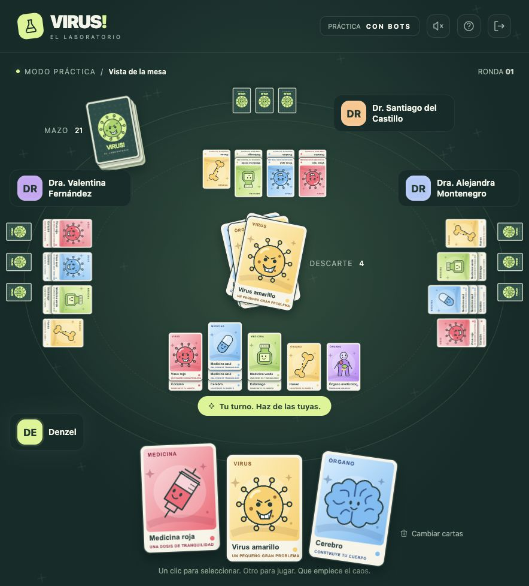
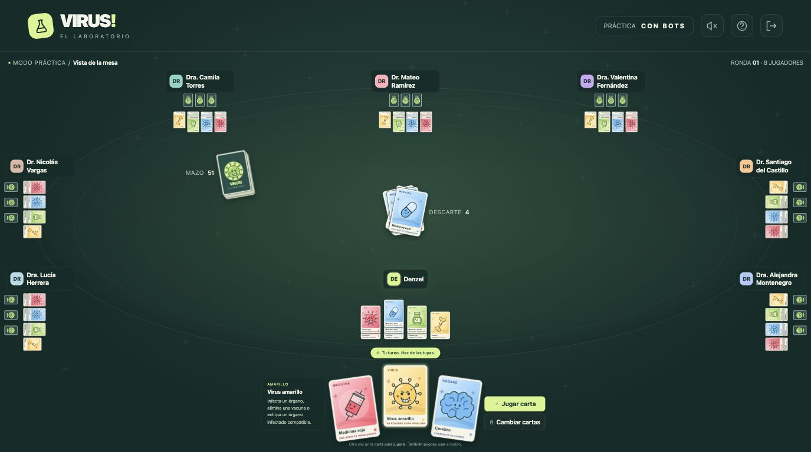

# VIRUS! · El laboratorio

Adaptación independiente y jugable en español de VIRUS!, basada en `Virus.pdf`. Arte vectorial original, cartas planas con selección elevada y lanzamiento con perspectiva, fondo de Three.js y multijugador real mediante WebSocket.



## Abrir el juego

Requiere Node.js 22.13 o superior (24 LTS recomendado). SQLite usa el módulo incluido en Node, sin dependencias nativas adicionales.

```sh
npm install
npm start
```

Abre http://localhost:3000. Valida primero un código de acceso generado desde el panel de administración. Después escribe tu nombre y crea una sala. Elige entre 2 y 8 plazas al crear la sala y comparte el código con hasta siete amigos. El anfitrión puede comenzar con al menos dos participantes. La práctica usa la cantidad de plazas seleccionada y añade hasta siete bots.

En una misma red, los demás entran desde `http://IP-DE-TU-COMPUTADORA:3000`. Un enlace de localhost solo sirve en la computadora que ejecuta el servidor: para invitar desde otra computadora, abre primero la dirección IP de la red y comparte esa dirección y el código de la sala. Para jugadores en redes diferentes, aloja este servidor en un servicio público que admita Node.js, WebSocket y almacenamiento persistente, con HTTPS. No basta con subir los archivos HTML a un alojamiento estático.

## Administración y accesos en local

Abre **http://localhost:3000/admin**. En el primer arranque, si no defines `ADMIN_PASSWORD`, el servidor crea una contraseña aleatoria en **`data/admin-password.txt`** con permisos privados. Abre ese archivo local para iniciar sesión. Puedes definir tu propia contraseña (mínimo 12 caracteres, máximo 256) mediante la variable `ADMIN_PASSWORD` al iniciar el servidor. La sesión de administración dura 12 horas y usa una cookie HttpOnly; los accesos de jugadores no permiten administrar.

El panel permite:

- Crear salas de **2 a 8 plazas**, con un código individual por plaza. El primer jugador que entra será anfitrión. El acceso individual no permite crear otras salas ni ocupar dos asientos simultáneamente, aunque se comparta el código. Las reconexiones usan la sesión privada del asiento.
- Elegir la vigencia de la sala y sus accesos, y las partidas incluidas: **1 partida + 1 revancha** por defecto, solo una partida o ilimitadas durante la vigencia. Una partida comienza a contar al iniciarse, incluso si termina por abandono. Una revancha sin suficientes confirmaciones no consume otra partida.
- Generar códigos **temporales** con fecha/hora de vencimiento y un máximo de **1 o 2 salas distintas**. El cupo pertenece al código y se comparte entre todos los dispositivos que lo usen. Entrar de nuevo en la misma sala no consume otro cupo; cerrar una sala no devuelve el cupo. Tanto crear como unirse a una sala consume uno, incluida la práctica con bots. Las revanchas en esa misma sala no consumen salas adicionales y son ilimitadas mientras el acceso siga vigente. Este código puede compartirse entre jugadores dentro de las salas permitidas; para entregar un acceso por persona, utiliza los accesos individuales de una sala administrada.
- Generar códigos de **acceso total** con la vigencia que elijas: creación y entrada a salas, práctica y revanchas ilimitadas en las salas creadas con ese acceso. Las salas administradas mantienen el paquete de partidas que tú les configuraste. El acceso total puede entrar también a ellas.
- Consultar salas en espera y partidas en curso, con ocupación, conexión de participantes y duración. Se actualizan cada cinco segundos. El historial registra cada partida y revancha por separado, con inicio, fin, duración, participantes y ganador. Una práctica cerrada antes de terminar figura como interrumpida. El historial nuevo comienza con esta implementación; no se inventan duraciones de partidas antiguas que carecen de fechas.
- Revocar códigos. El vencimiento o la revocación bloquea nuevas entradas, nuevas partidas y revanchas; una partida ya iniciada puede terminar y sus jugadores pueden reconectarse. Para iniciar una partida o revancha, todos sus participantes humanos deben conservar un acceso vigente.

**Flujo de jugadores:** ingresar código de acceso → escribir nombre → crear o unirse a una sala. Los accesos individuales ya muestran su sala asignada. El código corto de seis caracteres identifica la sala; no sustituye al código de acceso. No se incluyen credenciales en enlaces de invitación.

Los códigos completos pueden volver a consultarse mientras estén vigentes, incluso después de recargar o reiniciar. En «Códigos activos» puedes consultar los accesos vigentes. «Todos los accesos» muestra el estado y la vigencia en páginas de cinco registros. Los accesos individuales se agrupan por sala en recuadros; al abrirlos aparece una ventana para copiar cada código, copiar la sala (solo sus seis caracteres), descargar los accesos o revocarlos con confirmación dentro de la web. Los temporales y totales aparecen en sus propios recuadros. Los recuadros indican el estado de sus salas (en espera, en curso o finalizada). En las salas con accesos individuales, «Revocar acceso completo» revoca todos los cupos de una vez, sin interrumpir la partida actual. La consulta del código completo requiere sesión de administrador y no se incluye en las actualizaciones generales. En SQLite se guardan hashes de códigos y sesiones, sus vigencias, revocaciones y asociaciones acumuladas con salas; los códigos consultables se conservan además cifrados con AES-256-GCM. No hay procesamiento de pagos: tú generas y entregas los accesos.

Los accesos anteriores a este visor que solo tienen un hash no se pueden reconstruir. Se importan los que aún estén en `data/accesos-locales.txt`; para los restantes, el botón «Preparar copia del acceso» genera un código alternativo bajo el mismo permiso. El original sigue funcionando y ambos comparten exactamente la misma vigencia, revocación y cupos acumulados; las sesiones existentes se conservan.

### Persistencia

- **`data/virus.sqlite`**: códigos, cupos usados, sesiones de acceso/administrador e historial. SQLite usa WAL y transacciones para que dos dispositivos no gasten el último cupo de sala a la vez.
- **`data/rooms.json`**: estado de salas y partidas en curso, conservando el mecanismo anterior.
- **`data/access-code.key`**: clave privada para consultar los códigos cifrados. Respáldala junto con SQLite; si se pierde, esos códigos no podrán mostrarse.
- **`data/admin-password.txt`**: contraseña local generada si no configuras una propia; no se sirve por HTTP ni se añade a Git.

Mantén un solo proceso de juego y conserva el directorio `data` en EC2. Para un respaldo consistente, detén el servidor y copia el directorio completo (incluidos los archivos WAL si existen), o utiliza la herramienta de respaldo de SQLite. Reiniciar conserva códigos, cupos e historial. Una sala eliminada no libera cuotas. Si no restauras el archivo de salas, los registros en curso se marcan interrumpidos al iniciar; los códigos individuales de esas salas necesitarán reemplazo. La interfaz también puede publicarse por separado en S3: consulta [la prueba local con Floci](docs/floci.md).

Los nuevos guardados incluyen la fecha del último checkpoint del servidor. Al recuperar una sala, los plazos de ausencia, turno, revancha y caducidad por inactividad se desplazan por el tiempo transcurrido desde ese checkpoint. Las vigencias de códigos y salas administradas mantienen su fecha absoluta. Los archivos anteriores sin checkpoint conservan el comportamiento previo. Un apagado abrupto permite recuperar hasta el último guardado; el historial sigue midiendo la duración de las partidas por tiempo de calendario, incluida la interrupción.

## Jugar

- Primer clic: selecciona y eleva la carta. Segundo clic: juega un órgano o un guante, o permite elegir un destino. También puedes pulsar «Jugar carta».
- Los destinos válidos brillan en verde. Virus y medicinas permiten escoger cualquier cuerpo, incluido el propio.
- Trasplante: escoge dos órganos entre dos jugadores cualesquiera. Error médico: escoge un rival. Contagio: elige una distribución máxima de tus virus; se propone una válida automáticamente.
- «Cambiar cartas»: la carta seleccionada se conserva y queda marcada para cambiar. Puedes añadir otras cartas o desmarcarlas y luego confirmar. Es una acción completa de turno.
- Las cartas robadas se reponen automáticamente. No se permite pasar sin jugar o descartar.
- Cuatro órganos diferentes sanos, vacunados o inmunizados ganan. El multicolor cuenta como órgano independiente: puedes tener cinco y ganar con cuatro sanos.
- Haz clic en un órgano para inspeccionar sus virus y vacunas. La ayuda contiene todas las reglas, tratamientos y aclaraciones multicolor. Escape cancela la selección.

Mazo base de 68 cartas (2 a 4 participantes): 21 órganos (5 de cada color básico y 1 multicolor), 17 virus (4 de cada color básico y 1 multicolor), 20 medicinas (4 por color, incluido multicolor), y 10 tratamientos (1 trasplante, 3 ladrones, 2 contagios, 3 guantes y 1 error médico). Al agotarse el mazo, se voltea el descarte sin barajar.

Para 5 a 8 participantes, esta adaptación usa una variante con mazo ampliado. Se multiplica la cantidad original de cada combinación de tipo y color, y de cada tratamiento, por `participantes / 4` y se redondea a la carta más cercana. Los cuatro colores básicos conservan exactamente la misma cantidad entre sí. Cada copia tiene su propio identificador y el mismo diseño; los órganos multicolor siguen siendo un color independiente y no se pueden repetir en un cuerpo.

| Participantes al comenzar | Cartas totales |
|---|---|
| 2–4 | 68 |
| 5 | 84 |
| 6 | 107 |
| 7 | 121 |
| 8 | 136 |

A ocho, la distribución es exactamente el doble: 42 órganos, 34 virus, 40 medicinas y 20 tratamientos. El tamaño depende de quienes comienzan la partida, no de las plazas libres. El mazo queda fijo durante la partida, incluso si hay eliminaciones; una revancha recalcula el mazo para los participantes que queden. Se conservan manos de tres cartas y la victoria con cuatro órganos sanos. El reglamento comercial indica 2 a 6 jugadores; el ajuste del mazo y la opción de ocho son reglas de esta adaptación. Las pruebas de partidas completas verifican conservación y victorias; el equilibrio entre jugadores humanos puede afinarse con partidas reales.



## Salas, privacidad y reconexión

El servidor es la autoridad sobre las jugadas. Cada sala tiene su propio estado, mazo, descarte, versión y temporizador. El cliente recibe solo su mano; los rivales se muestran con cartas ocultas. El servidor valida turno, pertenencia, revisión de mesa, destinos, tratamientos y capacidad antes de modificar el juego. Una sesión usa un token aleatorio que nunca se comparte en el enlace de invitación.

Al recargar o perder conexión, se retoma el mismo asiento desde esta pestaña. «Salir» de una partida online permite retomarla con «Reanudar sala» en el mismo navegador y pestaña durante cinco minutos. Tras 25 segundos sin actuar en su turno, el jugador pasa a piloto automático. Después de 15 turnos propios consecutivos en automático queda eliminado y sus cartas vuelven al mazo. El botón «Retomar control» o una jugada humana válida reinicia ese contador. El aviso bajo su nombre y los turnos restantes son privados. Los turnos de reposición por guante no consumen un turno de piloto. Los jugadores desconectados también pueden usar el piloto mientras quede algún humano conectado. Al cumplir cinco minutos seguidos desconectado, queda eliminado: todas sus cartas, incluidos órganos, virus y medicinas sobre la mesa, se reintegran al mazo y este se baraja. La partida continúa con el siguiente jugador que corresponda, sin saltar a otro jugador por un cambio de índices. Si queda un solo jugador, gana por abandono aunque no tenga cuatro órganos sanos. Si todos son eliminados a la vez, la partida se cierra sin ganador. La reconexión antes del plazo cancela la eliminación. El plazo también libera asientos ausentes en el lobby y se conserva al reiniciar el servidor. El anfitrión pasa a un jugador que siga en la sala. Si no hay humanos conectados, los turnos se pausan, pero los plazos de ausencia siguen corriendo. Los bots no se añaden a partidas online ni quedan eliminados por desconexión.

El anfitrión inicia la primera partida. Cualquier participante puede solicitar una revancha; cada jugador debe confirmar. La solicitud espera como máximo 1:30 y empieza con al menos dos confirmados y conectados. Si todos responden antes, se resuelve de inmediato. Quienes no confirmen salen de esa revancha. Si abandona el lobby, el siguiente jugador pasa a ser anfitrión. El estado de las salas se guarda en `data/rooms.json` después de cada cambio, mediante escritura temporal y renombrado. Tras reiniciar el servidor, los jugadores pueden reconectarse a su partida. Las salas vacías del lobby caducan a los 30 minutos; las partidas sin humanos conectados, a las 24 horas. Si el archivo de estado está dañado, el servidor se detiene para evitar sobrescribirlo.

El sistema está diseñado para **un proceso de servidor** con múltiples salas. No ejecutes varias instancias contra el mismo archivo. Para escalar a varios servidores necesitarás almacenamiento compartido, coordinación de salas y afinidad de conexión; el motor de reglas puro permite esa evolución.

## Configuración

| Variable | Por defecto | Uso |
|---|---|---|
| `PORT` | `3000` | Puerto HTTP y WebSocket |
| `HOST` | `0.0.0.0` | Dirección de escucha |
| `FRONTEND_ORIGINS` | Vacío | Orígenes adicionales exactos del cliente para `/health`, `/api/access` y WebSocket, separados por comas; la administración mantiene el mismo origen |
| `TRUST_PROXY` | Desactivado | Usa IP y protocolo de `X-Forwarded-*` solamente detrás de un proxy confiable, con Node sin exposición directa |
| `MAX_PLAYERS` | `8` | Límite del servidor entre 2 y 8; cada nueva sala elige su capacidad |
| `MAX_ROOMS` | `500` | Límite de salas por proceso, no garantía de carga |
| `STATE_FILE` | `data/rooms.json` | Estado privado de salas |
| `DB_FILE` | `virus.sqlite`, junto a `STATE_FILE` | SQLite privado para accesos e historial |
| `ADMIN_PASSWORD` | Contraseña aleatoria en archivo local | Contraseña del panel, de 12 a 256 caracteres |
| `TURN_TIMEOUT_MS` | `25000` | Inactividad por turno antes del piloto |
| `AUTO_DELAY_MS` | `1800` | Espera para jugadas automáticas |
| `REMATCH_TIMEOUT_MS` | `90000` | Espera máxima de confirmaciones (1:30) |
| `DISCONNECT_TIMEOUT_MS` | `300000` | Plazo de ausencia antes de la eliminación (5 minutos) |

Las salas conservan la capacidad con la que fueron creadas, incluidas las partidas guardadas de cuatro plazas. El selector de nuevas salas ofrece de 2 a `MAX_PLAYERS` plazas (4 preseleccionadas). Las mesas de 5 a 8 jugadores distribuyen hasta tres rivales al frente y dos en cada lateral; en pantallas estrechas, los rivales aparecen en una cuadrícula. Durante la partida, la mesa completa se ajusta al espacio disponible bajo el encabezado, sin desplazamiento de la página. Las cartas conservan sus proporciones y el ajuste se recalcula al cambiar el tamaño de la ventana o la orientación. Los detalles de órganos y las reglas siguen disponibles en sus ventanas habituales.

## Pruebas

```sh
npm test
```

Pruebas adicionales de administración y acceso: autenticación, origen, validación, protección de datos privados, creación de salas de 2 a 8, códigos individuales, acceso temporal y total, cuota global entre dispositivos y tras reinicio, admisiones fallidas, uso concurrente del último cupo, revocación y vencimiento sin interrumpir la partida, historial y duración, revanchas con confirmación y plazos, límites de partidas y piloto privado. Se usan bases SQLite temporales.

Pruebas del motor: distribución y escalado del mazo hasta ocho, manos privadas, colores, inmunidad, curas, vacunas, extirpación, cinco tratamientos, contagio máximo, guante, turnos, descarte, reciclaje del mazo, victorias y 68 partidas generadas completas entre 4 y 8 participantes, con conservación de todas las cartas. Pruebas del servidor: ocho clientes simultáneos, capacidades por sala, límite de ocho, siete bots, orden completo de turnos, reinicio de partidas ampliadas, cuatro clientes en salas anteriores, una segunda partida independiente, sala llena, acciones inválidas, revisiones antiguas, acceso del anfitrión, sesión privada, reconexión, sustitución de conexión, recuperación tras reinicio y eliminación por ausencia, devolución íntegra de cartas, avance correcto de turnos y victoria por abandono. Los tests acortan el plazo mediante `DISCONNECT_TIMEOUT_MS`; en el juego normal son cinco minutos. Se usan servidores temporales y un archivo separado; no se modifica la partida de desarrollo.

## Alojamiento

Para publicar en AWS sin CloudFront, sigue [la guía de S3 + EC2](docs/aws-s3-ec2.md). Incluye `deploy/compose.aws.yaml`, Caddy con HTTPS automático, persistencia y pasos de apagado/encendido. La configuración de producción mantiene Node dentro de Docker y publica únicamente 80/443.

### Prueba S3 + EC2 con Floci

```sh
floci start --persist=/Users/denzel/.floci/data
npm run floci:up
```

Si Floci ya está ejecutándose con esa persistencia, basta con el segundo comando. Abre `http://localhost:4566/virus-laboratorio-local/index.html`. El servidor y el panel usan `http://localhost:3100` y `http://localhost:3100/admin`.

`npm run floci:stop` apaga la instancia emulada y permite ver «El laboratorio está en espera» sin detener S3. `npm run floci:start` vuelve a encenderla; la interfaz reconecta automáticamente. `npm run floci:verify` comprueba recursos estáticos, acceso, una partida de dos personas, una jugada, apagado y recuperación del mismo asiento y mano. Genera un código de prueba en `tmp/floci/demo-access.txt`. El montaje, la persistencia y los límites de esta emulación se describen en [docs/floci.md](docs/floci.md).

### Generar el cliente para S3

```sh
API_BASE_URL=https://juego.example.com npm run build:client
```

Publica solo el contenido de `dist/client/`. El build incluye las reglas compartidas y Three.js, configura API y WebSocket y deja la administración en EC2. Puedes definir `WS_URL` y `ADMIN_URL` si necesitas direcciones distintas. Las rutas de recursos son relativas para admitir tanto la URL de objetos de S3 como la emulación por ruta de Floci. En EC2, configura `FRONTEND_ORIGINS` con el origen público exacto del bucket. El cliente comprueba `/health` y espera el saludo WebSocket antes de habilitar el juego; conserva el acceso guardado durante errores de red.

### Servidor con Docker

```sh
docker compose up --build -d
```

El volumen `virus-data` conserva las partidas. Coloca un proxy con HTTPS delante del puerto 3000 y habilita la actualización WebSocket. Mantén el encabezado `Host` del navegador al reenviar solicitudes: se comprueba que el origen coincida con él. Respalda el volumen y no publiques su contenido. Endpoint de estado: `/health`.

Este repositorio incluye la configuración de despliegue, pero no está publicado en Internet. La prueba local no equivale a una prueba de carga de 500 salas.

## Estructura

`shared/game.js`: reglas puras, acciones válidas y vista privada por jugador. `server/index.js`: salas, sesiones, WebSocket, bots y persistencia. `server/store.js`: SQLite y cupos. `server/admin.js`: API protegida de administración y validación de accesos. `public/admin.html`, `public/admin.js` y `public/admin.css`: panel. `public/access.css`: entrada y avisos privados. `public/app.js`: interfaz y animaciones. `public/art.js`: ilustraciones y cartas SVG. `public/scene.js`: fondo de Three.js. `public/style.css`: diseño adaptable y movimiento reducido. `public/expanded.css`: salas y mesa ampliada hasta ocho, con distribución adaptable. `public/table.css`: mesa sin distorsión de perspectiva, manos laterales en columna, mano frontal en fila, órganos con virus y medicinas superpuestos y descarte apilado. `public/viewport.js` y `public/viewport.css`: ajuste proporcional de la mesa al espacio real del navegador, con separación de nombres y controles en pantallas pequeñas. `public/turn-cue.js` y `public/turn-cue.css`: flechas y resalte breve al cambiar el turno.

## Referencias

- Reglamento adjunto: `Virus.pdf`.
- [Aclaraciones oficiales de VIRUS!, Tranjis Games](https://tranjisgames.com/blog/nuestros-juegos-7/virus-preguntas-frecuentes-9), especialmente las interacciones multicolor.
- [UNO para PC, Ubisoft](https://www.ubisoft.com/en-gb/games/uno), además de las capturas adjuntas, como referencia de mesa, mano visible, selección y lanzamiento.

VIRUS! es de Tranjis Games. Esta es una adaptación independiente sin afiliación. Las ilustraciones son originales de este proyecto; no se reutilizan las ilustraciones comerciales del PDF o de las fotos.
